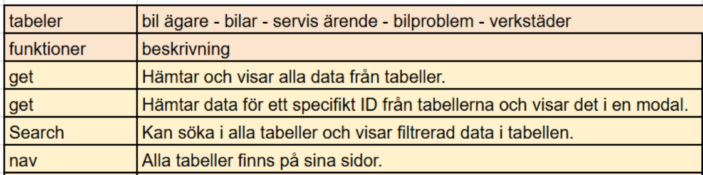
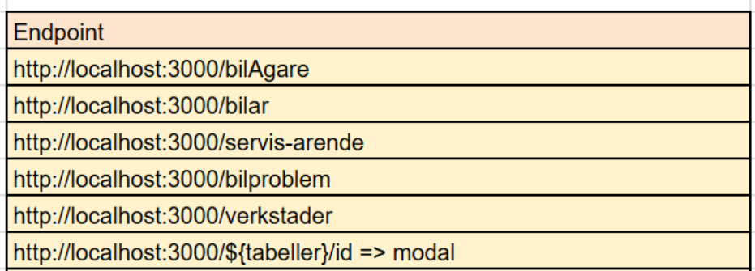
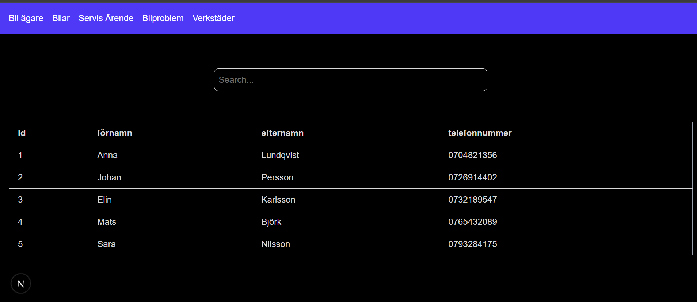
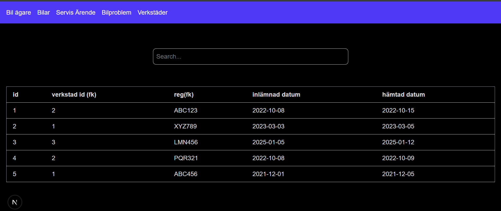
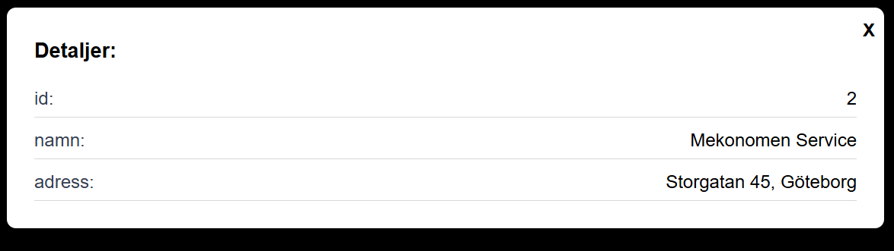

# next.js-projekt | Bilverkstad

Detta projekt handlar om att skapa en fullstack-applikation med Next.js, React, Tailwind CSS, TypeScript och MySQL. Applikationen hämtar data från databasen och visar den på webbsidan.

## Funktioner



## 🛠️ Teknologier
```bash
Projektet är byggt med:

Next.js
React
Tailwind CSS
TypeScript
MySQL
```

## 📂 Projektstruktur


## ⚙️ Installation och uppstart

#### Installera

```bash
Node.js
MySQL
```

#### Klona projektet

```bash
git clone https://github.com/Mahdi-0011/next-js-projekt
cd next.js-projekt
```

#### Installera beroenden

```bash
npm install
```

#### Importera bilverkstad.sql filen

Skapa databas:

```bash
CREATE DATABASE bilverkstad;
```

Sedan:

```bash
kopiera bilverkstad.sql i din mysql terminal.
```

#### Skapa .env-fil

```bash
DB_HOST=localhost
DB_USER=din user name
DB_PASSWORD=din password
DB_NAME=bilverkstad

```

#### Starta projektet

```bash
npm run dev
```

## 🔑 API Endpoints


```bash
Observera: API-endpoints fungerar bara om MySQL är installerad och databasen är importerad.
```

## 🖼️Bilder







